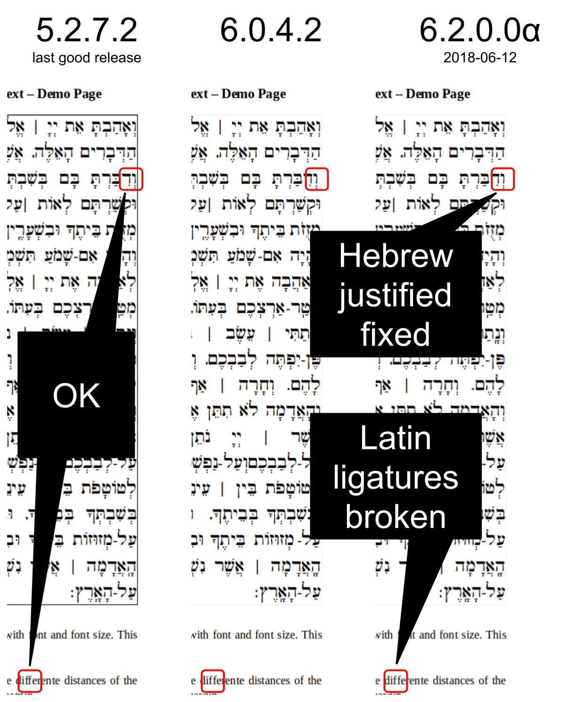

# libreoffice-bug-rtl-justified-regression
Helper files and tools for LibreOffice Bugs [105913](https://bugs.documentfoundation.org/show_bug.cgi?id=105913) and [112093](https://bugs.documentfoundation.org/show_bug.cgi?id=112093)

This demonstrates the problems:


Hebrew or CTL text doesn't have the margins flush in justified text and ligatures are not printed correctly. With recent builds (2018-06-12) the CTL justified text problem seems to be solved, but the ligatures problem is not yet solved.

The problems where introduced with major changes to the layout engine in 5.3.

The files in this repo help to quickly check for the bug.

To check a new version of LibreOffice against the "reference" 5.2.7.2 simply execute the `run.sh` script like this:

```bash
$ ./bin/run.sh 6.0.4.2
Downloading LibreOffice archive
Unpacking LibreOffice archive
Unpacking LibreOffice packages
Prepared work/LibreOffice_6.0.4.2_9b0d9b32d5dcda91d2f1a96dc04c645c450872bf/soffice
LibreOffice 6.0.4.2 9b0d9b32d5dcda91d2f1a96dc04c645c450872bf
convert /home/schlomo/src/libreoffice-bug-rtl-justified-regression/demo.odt -> /home/schlomo/src/libreoffice-bug-rtl-justified-regression/work/LibreOffice_6.0.4.2_9b0d9b32d5dcda91d2f1a96dc04c645c450872bf/demo.png using filter : writer_png_Export
'work/LibreOffice_6.0.4.2_9b0d9b32d5dcda91d2f1a96dc04c645c450872bf/demo.png' -> 'results/LibreOffice_6.0.4.2_9b0d9b32d5dcda91d2f1a96dc04c645c450872bf.png'
demo_5.2.7.2 and LibreOffice_6.0.4.2_9b0d9b32d5dcda91d2f1a96dc04c645c450872bf are different by 30935
```

The script will download the DEB distribution, unpack it into a work folder and convert the included (demo)[demo.odt] file to a PNG image. It then compares the resulting image with a reference image created with LibreOffice 5.2.7.2.

There is also another script `compare_all.sh` that compares all available result images against each other.

In the [comparisons](./comparisons/) folder there are [ImageMagick compare](http://www.imagemagick.org/Usage/compare/#compare) images that show the different.

All scripts are in the `bin` folder.